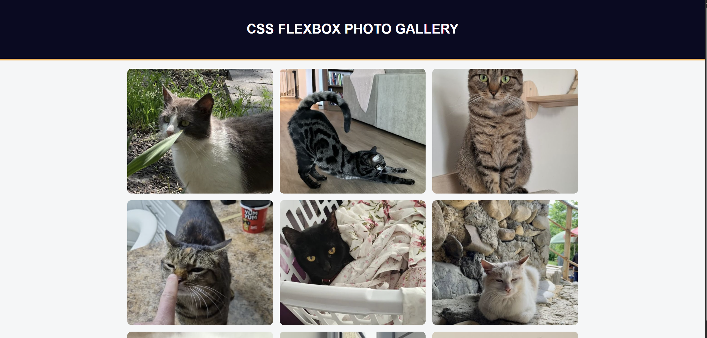

# flexbox-photo-gallery

A photo gallery of cats.

**Live-Demo:** [https://oendemann.github.io/flexbox-photo-gallery/]

---

---

## About The Project

Part of the web design course on freeCodeCamp. This project showcases the capabilities of flexbox design in CSS.

---

## Built With

* **HTML:** Used for the structure of the gallery, and to link the CSS file to the webpage.
* **CSS:** Used for most of the design (flexbox, padding, centering, background-color, etc).

---

## What I Learned

1. I have a better understanding of how to nicely format a webpage with flexbox, and how it uses horizontal and vertical axes.
2. I learned about some new css syntax, such as "justify-content", "text-transform", and "object-fit".

---

## Acknowledgments

* Project idea and requirements from [freeCodeCamp.org](https://www.freecodecamp.org/)